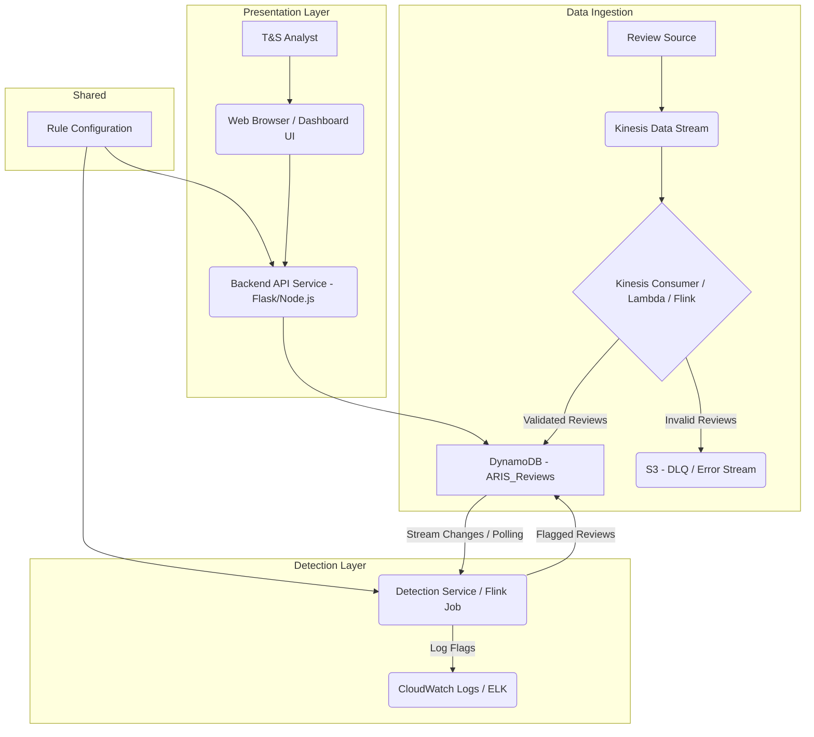

## Sprint 1 Implementation Plan: Amazon Review Integrity Shield (ARIS)

### 1) Sprint Goal:
"To establish the foundational data ingestion and basic rule-based detection capabilities for ARIS, enabling initial identification of obvious abuse patterns and providing a basic dashboard for analysts to view and investigate flagged reviews."

### 2) Overall System Architecture

The ARIS system will be designed with a microservices-oriented architecture, leveraging cloud-native services for scalability, reliability, and ease of management.

*   **Data Ingestion Layer:** Responsible for consuming raw review data, performing initial validation, and storing it reliably.
*   **Detection Layer:** A dedicated service to apply rule-based logic to incoming reviews and identify potential abuse.
*   **Data Storage Layer:** Scalable databases for both raw review data and rule configurations.
*   **Presentation Layer:** A web application (dashboard) for Trust & Safety analysts to view and manage flagged reviews.



### 3) Data Models

#### `Review` Data Model (Stored in DynamoDB: `ARIS_Reviews` table)

```json
{
  "reviewId": "string (Primary Key)",
  "userId": "string (GSI Candidate)",
  "productId": "string (GSI Candidate)",
  "rating": "integer (1-5)",
  "timestamp": "long (epoch milliseconds)",
  "title": "string",
  "content": "string",
  "ipAddress": "string",
  "country": "string",
  "deviceInfo": "string",
  "sentimentScore": "float (Future extension)",
  "isFlagged": "boolean (Default: false)",
  "flagReasons": "list of strings (e.g., ['IP_FREQUENCY_VIOLATION', 'ACCOUNT_FREQUENCY_VIOLATION'])",
  "reviewUrl": "string (Optional: link to original review)"
}
```

#### `Rule Configuration` Data Model (Could be stored in a separate DynamoDB table `ARIS_Rules` or configuration file)

```json
{
  "ruleId": "string (Primary Key)",
  "ruleName": "string",
  "ruleDescription": "string",
  "ruleType": "string (e.g., 'IP_FREQUENCY', 'ACCOUNT_FREQUENCY')",
  "parameters": { // JSON object for rule-specific parameters
    "threshold": "integer",
    "windowHours": "integer"
  },
  "isEnabled": "boolean"
}
```

---

### 4) Task-by-Task Implementation Plan

---

#### **US1.1 - Review Data Ingestion**

*   **Task 1.1.1: Design and implement a data pipeline to ingest new Amazon reviews.**
    *   **Implementation Plan:** We will leverage AWS Kinesis Data Stream as the primary ingestion point for raw review data. A Kinesis Consumer (implemented as an AWS Lambda function or a dedicated Flink application) will read from the stream, perform initial parsing and schema enforcement, and then write the validated data into a DynamoDB table named `ARIS_Reviews`.
    *   **Architecture:** `Review Source (Producer) -> Kinesis Data Stream -> Kinesis Consumer (Lambda) -> DynamoDB (ARIS_Reviews)`
    *   **Assumptions:** Review data is provided by Amazon in a structured (e.g., JSON) format and pushed to our Kinesis stream.
    *   **Technical Decisions:**
        *   **Kinesis Data Stream:** Chosen for real-time data streaming, scalability, and managed service benefits.
        *   **AWS Lambda:** For cost-effective, serverless processing of Kinesis records, suitable for initial validation and writes to DynamoDB.
        *   **DynamoDB:** For its high-performance, scalable, and fully managed NoSQL capabilities, ideal for storing high-volume review data.
    *   **Code Snippet (Pseudocode for Kinesis Lambda Consumer):**
        ```python
        import json
        import base64
        import os
        import boto3

        dynamodb = boto3.resource(\'\'\'dynamodb\'\'\')
        reviews_table = dynamodb.Table(os.environ.get(\'\'\'REVIEWS_TABLE_NAME\'\'\', \'\'\'ARIS_Reviews\'\'\'))

        def handler(event, context):
            for record in event[\'\'\'Records\'\'\']:
                try:
                    payload = base64.b64decode(record[\'\'\'kinesis\'\'\'][\'\'\'data\'\'\']).decode(\'\'\'utf-8\'\'\')
                    review_data = json.loads(payload)

                    # Basic validation (more comprehensive validation in Task 1.1.4)
                    if not all(k in review_data for k in [\'\'\'reviewId\'\'\', \'\'\'userId\'\'\', \'\'\'productId\'\'\', \'\'\'timestamp\'\'\', \'\'\'content\'\'\']):
                        print(f"Skipping record due to missing essential fields: {review_data}")
                        continue

                    # Prepare item for DynamoDB (add default flags)
                    item = {
                        \'\'\'reviewId\'\'\': review_data[\'\'\'reviewId\'\'\'],
                        \'\'\'userId\'\'\': review_data[\'\''''userId\'\'\'],
                        \'\'\'productId\'\'\': review_data[\'\'\'productId\'\'\'],
                        \'\'\'rating\'\'\': review_data.get(\'\'\'rating\'\'\'),
                        \'\'\'timestamp\'\'\': review_data[\'\'\'timestamp\'\'\'],
                        \'\'\'title\'\'\': review_data.get(\'\'\'title\'\'\'),
                        \'\'\'content\'\'\': review_data[\'\'\'content\'\'\'],
                        \'\'\'ipAddress\'\'\': review_data.get(\'\'\'ipAddress\'\'\'),
                        \'\'\'country\'\'\': review_data.get(\'\'\'country\'\'\'),
                        \'\'\'deviceInfo\'\'\': review_data.get(\'\'\'deviceInfo\'\'\'),
                        \'\'\'isFlagged\'\'\': False,
                        \'\'\'flagReasons\'\'\': []
                    }

                    reviews_table.put_item(Item=item)
                    print(f"Successfully ingested review: {review_data[\'\'\'reviewId\'\'\']}")

                except json.JSONDecodeError as e:
                    print(f"JSON decoding error: {e} for record: {record[\'\'\'kinesis\'\'\'][\'\'\'data\'\'\']}")
                except Exception as e:
                    print(f"Error processing record: {e} for record: {record[\'\'\'kinesis\'\'\'][\'\'\'data\'\'\']}")
            return {\'\'\'statusCode\'\'\': 200, \'\'\'body\'\'\': \'\'\'Processed Kinesis records\'\'\'}
        ```

*   **Task 1.1.2: Configure near real-time data streaming for review data.**
    *   **Implementation Plan:** Provision an AWS Kinesis Data Stream with an appropriate number of shards to handle expected peak throughput. Ensure producers pushing data to the stream are configured for low-latency writes.
    *   **Architecture:** Kinesis Data Stream setup.
    *   **Assumptions:** The source system can push data to Kinesis with minimal delay.
    *   **Technical Decisions:** Use Kinesis Data Streams. Monitor shard utilization and adjust as needed.

*   **Task 1.1.3: Set up data storage for ingested reviews.**
    *   **Implementation Plan:** Create an AWS DynamoDB table named `ARIS_Reviews`.
        *   **Primary Key:** `reviewId` (Partition Key).
        *   **Global Secondary Indexes (GSIs):**
            *   `userId-timestamp-index` (Partition Key: `userId`, Sort Key: `timestamp`) for querying reviews by a specific user.
            *   `productId-timestamp-index` (Partition Key: `productId`, Sort Key: `timestamp`) for querying reviews by a specific product.
            *   `isFlagged-timestamp-index` (Partition Key: `isFlagged`, Sort Key: `timestamp`) to efficiently retrieve all flagged reviews.
    *   **Data Models:** `Review` data model as defined above.
    *   **Architecture:** DynamoDB table `ARIS_Reviews` with specified primary key and GSIs.
    *   **Assumptions:** DynamoDB's NoSQL nature and eventual consistency for GSIs are acceptable for our read patterns.
    *   **Technical Decisions:** DynamoDB chosen for scalability, high availability, and managed service benefits. GSIs for efficient query patterns required by the dashboard and detection rules.

*   **Task 1.1.4: Implement basic data validation and error handling for ingestion.**
    *   **Implementation Plan:** Enhance the Kinesis Lambda Consumer (from Task 1.1.1) to include more robust validation. This involves:
        *   **Schema Validation:** Check for mandatory fields (`reviewId`, `userId`, `productId`, `timestamp`, `content`).
        *   **Type Checking:** Ensure fields like `rating` are integers, `timestamp` is numeric.
        *   **Range Checks:** For `rating` (1-5).
        *   **Error Handling:** Invalid records will be logged with detailed error messages and pushed to an AWS SQS Dead-Letter Queue (DLQ) for asynchronous review and reprocessing.
    *   **Architecture:** `Kinesis Consumer (Lambda with Validation) -> (Valid -> DynamoDB | Invalid -> SQS DLQ)`
    *   **Assumptions:** Upstream data may occasionally be malformed or incomplete.
    *   **Technical Decisions:** Python\'\'\'s built-in type checking and conditional logic for validation. SQS DLQ for robust error handling and eventual consistency.
    *   **Code Snippet (Pseudocode for enhanced validation in Lambda):**
        ```python
        import json
        import base64
        import os
        import boto3
        from datetime import datetime

        dynamodb = boto3.resource(\'\'\'dynamodb\'\'\')
        reviews_table = dynamodb.Table(os.environ.get(\'\'\'REVIEWS_TABLE_NAME\'\'\', \'\'\'ARIS_Reviews\'\'\'))
        sqs_client = boto3.client(\'\'\'sqs\'\'\')
        dlq_url = os.environ.get(\'\'\'DLQ_URL\'\'\')

        def validate_review_data(review_data):
            # 1. Check for mandatory fields
            required_fields = [\'\'\'reviewId\'\'\', \'\'\'userId\'\'\', \'\'\'productId\'\'\', \'\'\'timestamp\'\'\', \'\'\'content\'\'\']
            for field in required_fields:
                if field not in review_data or not review_data[field]:
                    raise ValueError(f"Missing or empty required field: {field}")

            # 2. Type and Value Checks
            if not isinstance(review_data[\'\'\'timestamp\'\'\'], (int, float)):
                raise TypeError("Timestamp must be a numeric value.")
            # Convert timestamp to integer if float
            review_data[\'\'\'timestamp\'\'\'] = int(review_data[\'\'\'timestamp\'\'\'])

            if \'\'\'rating\'\'\' in review_data:
                if not isinstance(review_data[\'\'\'rating\'\'\'], int) or not (1 <= review_data[\'\'\'rating\'\'\'] <= 5):
                    raise ValueError("Rating must be an integer between 1 and 5.")

            # Add more specific validations as needed (e.g., IP address format, content length)
            return review_data

        def handler(event, context):
            for record in event[\'\'\'Records\'\'\']:
                raw_data = record[\'\'\'kinesis\'\'\'][\'\'\'data\'\'\']
                try:
                    payload = base64.b64decode(raw_data).decode(\'\'\'utf-8\'\'\')
                    review_data = json.loads(payload)
                    validated_data = validate_review_data(review_data)

                    item = {
                        \'\'\'reviewId\'\'\': validated_data[\'\'\'reviewId\'\'\'],
                        \'\'\'userId\'\'\': validated_data[\'\'\'userId\'\'\'],
                        \'\'\'productId\'\'\': validated_data[\'\'\'productId\'\'\'],
                        \'\'\'rating\'\'\': validated_data.get(\'\'\'rating\'\'\'),
                        \'\'\'timestamp\'\'\': validated_data[\'\'\'timestamp\'\'\'],
                        \'\'\'title\'\'\': validated_data.get(\'\'\'title\'\'\'),
                        \'\'\'content\'\'\': validated_data[\'\''''content\'\'\'],
                        \'\'\'ipAddress\'\'\': validated_data.get(\'\'\'ipAddress\'\'\'),
                        \'\'\'country\'\'\': validated_data.get(\'\'\'country\'\'\'),
                        \'\''''deviceInfo\'\'\': validated_data.get(\'\'\'deviceInfo\'\'\'),
                        \'\'\'isFlagged\'\'\': False,
                        \'\'\'flagReasons\'\'\': []
                    }
                    reviews_table.put_item(Item=item)
                    print(f"Successfully ingested review: {validated_data[\'\'\'reviewId\'\'\']}")

                except (json.JSONDecodeError, ValueError, TypeError) as e:
                    error_message = f"Validation/Parsing Error: {e}. Record data: {payload}"
                    print(error_message)
                    if dlq_url:
                        sqs_client.send_message(
                            QueueUrl=dlq_url,
                            MessageBody=json.dumps({"error": error_message, "original_record": raw_data})
                        )
                except Exception as e:
                    error_message = f"Unexpected Error: {e}. Record data: {payload}"
                    print(error_message)
                    if dlq_url:
                        sqs_client.send_message(
                            QueueUrl=dlq_url,
                            MessageBody=json.dumps({"error": error_message, "original_record": raw_data})
                        )
            return {\'\'\'statusCode\'\'\': 200, \'\'\'body\'\'\': \'\'\'Processed Kinesis records\'\'\'}
        ```

---

#### **US1.2 - Basic Rule-Based Detection**

*   **Task 1.2.1: Define initial set of rule-based detection criteria.**
    *   **Implementation Plan:** Define two initial rules for flagging:
        1.  **Multiple Reviews from Same IP (IP_FREQUENCY_RULE):** Flag a review if the `ipAddress` has been associated with more than `N` reviews within the last `X` hours. (e.g., N=5, X=24)
        2.  **Unusually High Review Frequency from Single Account (ACCOUNT_FREQUENCY_RULE):** Flag a review if the `userId` has submitted more than `M` reviews within the last `Y` hours. (e.g., M=10, Y=24)
    *   **Data Models:** `Rule Configuration` (as defined above).
    *   **Architecture:** N/A (Documentation task).
    *   **Assumptions:** These initial rules will identify obvious abuse patterns. Thresholds (N, X, M, Y) are configurable.
    *   **Technical Decisions:** Keep rules simple and easily quantifiable for MVP.

*   **Task 1.2.2: Develop and integrate a rules engine for review flagging.**
    *   **Implementation Plan:** Create a dedicated "Detection Service" (e.g., another AWS Lambda function triggered by DynamoDB Streams or a continuously running AWS Fargate task). This service will:
        1.  **Consume Reviews:** Listen to changes in the `ARIS_Reviews` DynamoDB table via DynamoDB Streams (or poll).
        2.  **Apply Rules:** For each new/updated review, retrieve relevant historical data (e.g., other reviews from the same IP/user within the last X/Y hours) from `ARIS_Reviews` table (using GSIs).
        3.  **Evaluate:** Apply the `IP_FREQUENCY_RULE` and `ACCOUNT_FREQUENCY_RULE`.
        4.  **Update:** If a review is flagged, update its `isFlagged` status to `True` and append the triggered `flagReasons` to the `flagReasons` list in the `ARIS_Reviews` table.
    *   **Data Models:** `Review` (updates to `isFlagged` and `flagReasons`).
    *   **Architecture:** `DynamoDB (ARIS_Reviews) -> DynamoDB Streams -> Detection Service (Lambda) -> DynamoDB (Update ARIS_Reviews)`
    *   **Assumptions:** DynamoDB\'\'\'s eventual consistency for GSIs is acceptable for historical lookups in detection.
    *   **Technical Decisions:**
        *   **DynamoDB Streams:** Provides real-time event stream for changes in the `ARIS_Reviews` table, triggering the Detection Service.
        *   **AWS Lambda:** For serverless and event-driven processing of DynamoDB Stream records.
        *   **DynamoDB Queries:** Use the `userId-timestamp-index` and `ipAddress-timestamp-index` GSIs for efficient historical lookups.
    *   **Code Snippet (Pseudocode for Detection Service Lambda):**
        ```python
        import json
        import os
        import boto3
        from datetime import datetime, timedelta

        dynamodb = boto3.resource(\'\'\'dynamodb\'\'\')
        reviews_table = dynamodb.Table(os.environ.get(\'\'\'REVIEWS_TABLE_NAME\'\'\', \'\'\'ARIS_Reviews\'\'\'))

        # Rule configurations (could be loaded from a separate config table or file)
        RULES = {
            "IP_FREQUENCY_RULE": {"threshold": 5, "windowHours": 24, "reason": "Multiple reviews from same IP in short period"},
            "ACCOUNT_FREQUENCY_RULE": {"threshold": 10, "windowHours": 24, "reason": "High review frequency from single account"}
        }

        def get_recent_reviews(key_name, key_value, window_hours, current_timestamp):
            # Query the appropriate GSI for reviews within the window
            earliest_timestamp = current_timestamp - (window_hours * 3600 * 1000) # Convert hours to milliseconds
            
            # Dynamically select GSI based on key_name
            index_name = f"{key_name}-timestamp-index" 
            
            response = reviews_table.query(
                IndexName=index_name,
                KeyConditionExpression=boto3.dynamodb.conditions.Key(key_name).eq(key_value) & \\
                                     boto3.dynamodb.conditions.Key(\'\'\'timestamp\'\'\').gt(earliest_timestamp),
                ProjectionExpression=\'\'\'reviewId, timestamp\'\'\', # Only fetch necessary fields
                Limit=RULES[\'\'\'IP_FREQUENCY_RULE\'\'\'][\'\'\'threshold\'\'\'] + 10 # Fetch a few more than threshold for safety
            )
            return response[\'\'\'Items\'\'\']

        def handler(event, context):
            for record in event[\'\'\'Records\'\'\']:
                if record[\'\'\'eventName\'\'\'] == \'\'\'INSERT\'\'\' or record[\'\'\'eventName\'\'\'] == \'\'\'MODIFY\'\'\':
                    try:
                        new_image = record[\'\'\'dynamodb\'\'\'][\'\'\'NewImage\'\'\']
                        review_id = new_image[\'\'\'reviewId\'\'\'][\'\'\'S\'\'\']
                        user_id = new_image[\'\'\'userId\'\'\'][\'\'\'S\'\'\']
                        ip_address = new_image[\'\'\'ipAddress\'\'\'][\'\'\'S\'\'\'] if \'\'\'ipAddress\'\'\' in new_image else None
                        timestamp = int(new_image[\'\'\'timestamp\'\'\'][\'\'\'N\'\'\']) # DynamoDB stores numbers as strings

                        flagged = False
                        flag_reasons = []
                        
                        # Only apply rules if not already flagged by other means
                        if \'\'\'isFlagged\'\'\' in new_image and new_image[\'\'\'isFlagged\'\'\'][\'\'\'BOOL\'\'\']:
                            flagged = True
                            if \'\'\'flagReasons\'\'\' in new_image:
                                flag_reasons = [reason[\'\'\'S\'\'\'] for reason in new_image[\'\'\'flagReasons\'\'\'][\'\'\'L\'\'\']]

                        # Apply IP_FREQUENCY_RULE
                        if ip_address:
                            ip_rule = RULES["IP_FREQUENCY_RULE"]
                            recent_ip_reviews = get_recent_reviews(\'\'\'ipAddress\'\'\', ip_address, ip_rule[\'\'\'windowHours\'\'\'], timestamp)
                            if len(recent_ip_reviews) >= ip_rule[\'\'\'threshold\'\'\'] and ip_rule[\'\'\'reason\'\'\'] not in flag_reasons:
                                flagged = True
                                flag_reasons.append(ip_rule[\'\'\'reason\'\'\'])

                        # Apply ACCOUNT_FREQUENCY_RULE
                        user_rule = RULES["ACCOUNT_FREQUENCY_RULE"]
                        recent_user_reviews = get_recent_reviews(\'\'\'userId\'\'\', user_id, user_rule[\'\'\'windowHours\'\'\'], timestamp)
                        if len(recent_user_reviews) >= user_rule[\'\'\'threshold\'\'\'] and user_rule[\'\'\'reason\'\'\'] not in flag_reasons:
                            flagged = True
                            flag_reasons.append(user_rule[\'\'\'reason\'\'\'])
                        
                        if flagged:
                            # Update the review in DynamoDB
                            reviews_table.update_item(
                                Key={\'\'\'reviewId\'\'\': review_id},
                                UpdateExpression=\'\'\'SET isFlagged = :f, flagReasons = :r\'\'\',
                                ExpressionAttributeValues={
                                    \'\'\':f\'\'\': True,
                                    \'\'\':r\'\'\': flag_reasons
                                }
                            )
                            print(f"Review {review_id} flagged. Reasons: {flag_reasons}")

                    except Exception as e:
                        print(f"Error processing DynamoDB Stream record: {e}. Record: {record}")
            return {\'\'\'statusCode\'\'\': 200, \'\'\'body\'\'\': \'\'\'Processed DynamoDB Stream records\'\'\'}
        ```

*   **Task 1.2.3: Implement logging for rule-based flags.**
    *   **Implementation Plan:** Within the Detection Service (Lambda function), whenever a review is flagged or its flag reasons are updated, generate a structured log entry. This log entry will contain `reviewId`, `triggeredRule`, `flagReason`, `timestamp`, and relevant contextual data (`ipAddress`, `userId`, count that triggered the rule). Logs will be sent to AWS CloudWatch Logs.
    *   **Architecture:** `Detection Service -> CloudWatch Logs`
    *   **Assumptions:** CloudWatch Logs is sufficient for initial log aggregation and analysis.
    *   **Technical Decisions:** Python\'\'\'s standard `logging` module with JSON formatting for structured logs.
    *   **Code Snippet (Pseudocode for logging in Detection Service):**
        ```python
        import logging
        import json
        from datetime import datetime

        logger = logging.getLogger(__name__)
        logger.setLevel(logging.INFO)

        def log_flag_event(review_id, rule_name, reason, context_data):
            log_entry = {
                "level": "INFO",
                "message": "Review flagged by rule",
                "reviewId": review_id,
                "ruleName": rule_name,
                "reason": reason,
                "timestamp": datetime.utcnow().isoformat(),
                "context": context_data
            }
            logger.info(json.dumps(log_entry))

        # ... (inside Detection Service Lambda handler, after updating DynamoDB) ...
        if flagged:
            for reason_str in flag_reasons: # Iterate through actual reasons appended
                rule_name = "UNKNOWN_RULE"
                if RULES["IP_FREQUENCY_RULE"]["reason"] == reason_str:
                    rule_name = "IP_FREQUENCY_RULE"
                elif RULES["ACCOUNT_FREQUENCY_RULE"]["reason"] == reason_str:
                    rule_name = "ACCOUNT_FREQUENCY_RULE"

                log_flag_event(
                    review_id,
                    rule_name,
                    reason_str,
                    {"ipAddress": ip_address, "userId": user_id, "timestamp": timestamp}
                )
        ```

*   **Task 1.2.4: Write unit tests for detection rules.**
    *   **Implementation Plan:** Develop unit tests for the core logic of the Detection Service. This will involve:
        *   **Mocking DynamoDB interactions:** Use mocking frameworks (e.g., `unittest.mock` or `pytest-mock`) to simulate responses from `reviews_table.query()` to control the "historical data" and `reviews_table.update_item()`.
        *   **Test Cases:**
            *   Reviews that should *not* be flagged (below threshold).
            *   Reviews that should be flagged (at or above threshold).
            *   Edge cases (e.g., first review for an IP/user, reviews exactly at the window boundary).
            *   Tests for multiple rules flagging a single review.
    *   **Data Models:** N/A (Testing).
    *   **Architecture:** N/A.
    *   **Assumptions:** A Python testing framework (Pytest) is used.
    *   **Technical Decisions:** Pytest for its simplicity and powerful mocking capabilities.
    *   **Code Snippet (Pseudocode for Pytest):**
        ```python
        # test_detection_service.py
        import pytest
        from unittest.mock import MagicMock
        from datetime import datetime, timedelta
        from your_detection_service_module import handler, RULES, reviews_table # Assuming module import

        @pytest.fixture
        def mock_dynamodb_table():
            # Mock the DynamoDB table object for tests
            reviews_table.query = MagicMock()
            reviews_table.update_item = MagicMock()
            return reviews_table

        def _create_mock_stream_event(review_id, user_id, ip_address, timestamp, is_flagged=False, flag_reasons=None):
            return {
                \'\'\'Records\'\'\': [
                    {
                        \'\'\'eventName\'\'\': \'\'\'INSERT\'\'\',
                        \'\'\'dynamodb\'\'\': {
                            \'\'\'NewImage\'\'\': {
                                \'\'\'reviewId\'\'\': {\'\'\'S\'\'\': review_id},
                                \'\'\'userId\'\'\': {\'\'\'S\'\'\': user_id},
                                \'\'\'ipAddress\'\'\': {\'\'\'S\'\'\': ip_address},
                                \'\'\'timestamp\'\'\': {\'\'\'N\'\'\': str(timestamp)},
                                \'\'\'isFlagged\'\'\': {\'\'\'BOOL\'\'\': is_flagged},
                                \'\'\'flagReasons\'\'\': {\'\'\'L\'\'\': [{\'\'\'S\'\'\': r} for r in (flag_reasons or [])]}
                            }
                        }
                    }
                ]
            }

        def test_ip_frequency_rule_flags_correctly(mock_dynamodb_table):
            current_timestamp = int(datetime.utcnow().timestamp() * 1000)
            
            # Setup mock for get_recent_reviews to return enough items to trigger
            mock_dynamodb_table.query.return_value = {
                \'\'\'Items\'\'\': [
                    {\'\'\'reviewId\'\'\': f\'\'\'r{i}\'\'\', \'\'\'timestamp\'\'\': current_timestamp - i * 1000}
                    for i in range(RULES["IP_FREQUENCY_RULE"]["threshold"]) # Simulate just enough to flag
                ]
            }

            event = _create_mock_stream_event(\'\'\'new_r1\'\'\', \'\'\'u1\'\'\', \'\'\'1.1.1.1\'\'\', current_timestamp)
            handler(event, None) # Call the lambda handler

            # Assert update_item was called with correct flags
            mock_dynamodb_table.update_item.assert_called_once()
            args, kwargs = mock_dynamodb_table.update_item.call_args
            assert kwargs[\'\'\'Key\'\'\'][\'\'\'reviewId\'\'\'] == \'\'\'new_r1\'\'\'
            assert kwargs[\'\'\'UpdateExpression\'\'\'] == \'\'\'SET isFlagged = :f, flagReasons = :r\'\'\'
            assert kwargs[\'\'\'ExpressionAttributeValues\'\'\'][\'\'\':f\'\'\'] is True
            assert RULES["IP_FREQUENCY_RULE"]["reason"] in kwargs[\'\'\'ExpressionAttributeValues\'\'\'][\'\'\':r\'\'\']

        def test_user_frequency_rule_does_not_flag_below_threshold(mock_dynamodb_table):
            current_timestamp = int(datetime.utcnow().timestamp() * 1000)
            
            # Setup mock for get_recent_reviews to return less than threshold
            mock_dynamodb_table.query.side_effect = [
                # For IP check (assume not flagged by IP)
                {\'\'\'Items\'\'\': []},
                # For User check (below threshold)
                {\'''Items\'\'\': [
                    {\'\'\'reviewId\'\'\': f\'\'\'r{i}\'\'\', \'\'\'timestamp\'\'\': current_timestamp - i * 1000}
                    for i in range(RULES["ACCOUNT_FREQUENCY_RULE"]["threshold"] - 1) # One less than threshold
                ]}
            ]

            event = _create_mock_stream_event(\'\'\'new_r2\'\'\', \'\'\'u2\'\'\', \'''2.2.2.2\'\'\', current_timestamp)
            handler(event, None)

            # Assert update_item was NOT called for flagging
            mock_dynamodb_table.update_item.assert_not_called()
        ```

---

#### **US1.4 - Abusive Review Dashboard**

*   **Task 1.4.1: Design dashboard UI for displaying flagged reviews.**
    *   **Implementation Plan:** Create wireframes and mockups using a design tool (e.g., Figma). The dashboard will feature:
        *   A table displaying flagged reviews with columns: `Review ID`, `Product ID`, `User ID`, `Rating`, `Timestamp`, `Flag Reasons`.
        *   Sorting and filtering options (e.g., by `Flag Reasons`, `Date Range`).
        *   Pagination for large datasets.
        *   Each row will be clickable, navigating to a detailed view of the review (US1.5).
        *   Clear visual indicators for flagged reviews.
    *   **Data Models:** N/A (UI Design).
    *   **Architecture:** N/A.
    *   **Assumptions:** A user-friendly and intuitive interface is crucial for analysts.
    *   **Technical Decisions:** Focus on clarity, readability, and efficient information display.

*   **Task 1.4.2: Develop front-end components for the dashboard.**
    *   **Implementation Plan:** Implement the dashboard UI using React. Key components will include:
        *   `FlaggedReviewsTable`: Displays the list of flagged reviews.
        *   `PaginationControls`: For navigating through pages of results.
        *   `FilterSidebar`: For applying filters.
        *   Utilize a UI library (e.g., Material-UI, Ant Design) for consistent styling and pre-built components.
    *   **Data Models:** Frontend components will consume a simplified `Review` object structure from the API.
    *   **Architecture:** `React Frontend Application -> Backend API Service`
    *   **Assumptions:** Developers are proficient in React and selected UI library.
    *   **Technical Decisions:** React for component-based development, strong ecosystem.
    *   **Code Snippet (Pseudocode for React Component):**
        ```jsx
        // src/components/FlaggedReviewsDashboard.jsx
        import React, { useState, useEffect } from \'\'\'react\'\'\';
        import axios from \'\'\'axios\'\'\';
        import { Link } from \'\'\'react-router-dom\'\'\'; // For navigation to detail view

        function FlaggedReviewsDashboard() {
            const [reviews, setReviews] = useState([]);
            const [loading, setLoading] = useState(true);
            const [error, setError] = useState(null);
            const [page, setPage] = useState(1);
            const [pageSize, setPageSize] = useState(10);
            const [totalReviews, setTotalReviews] = useState(0);

            useEffect(() => {
                const fetchFlaggedReviews = async () => {
                    try {
                        setLoading(true);
                        const response = await axios.get(`/api/flagged-reviews?page=${page}&pageSize=${pageSize}`);
                        setReviews(response.data.items);
                        setTotalReviews(response.data.total);
                    } catch (err) {
                        setError(err);
                    } finally {
                        setLoading(false);
                    }
                };
                fetchFlaggedReviews();
            }, [page, pageSize]); // Re-fetch when page or pageSize changes

            if (loading) return <div>Loading flagged reviews...</div>;
            if (error) return <div>Error: {error.message}</div>;

            return (
                <div className="dashboard-container">
                    <h1>Abusive Review Dashboard</h1>
                    {/* Filter components would go here */}
                    <table>
                        <thead>
                            <tr>
                                <th>Review ID</th>
                                <th>Product ID</th>
                                <th>User ID</th>
                                <th>Timestamp</th>
                                <th>Flag Reasons</th>
                                <th>Actions</th>
                            </tr>
                        </thead>
                        <tbody>
                            {reviews.length > 0 ? (
                                reviews.map(review => (
                                    <tr key={review.reviewId}>
                                        <td>{review.reviewId}</td>
                                        <td>{review.productId}</td>
                                        <td>{review.userId}</td>
                                        <td>{new Date(review.timestamp).toLocaleString()}</td>
                                        <td>{review.flagReasons.join(\', \')}</td>
                                        <td>
                                            <Link to={`/reviews/${review.reviewId}`}>View Details</Link>
                                        </td>
                                    </tr>
                                ))
                            ) : (
                                <tr><td colSpan="6">No flagged reviews found.</td></tr>
                            )}
                        </tbody>
                    </table>
                    <div className="pagination">
                        <button onClick={() => setPage(prev => Math.max(1, prev - 1))} disabled={page === 1}>Previous</button>
                        <span>Page {page} of {Math.ceil(totalReviews / pageSize)}</span>
                        <button onClick={() => setPage(prev => prev + 1)} disabled={page * pageSize >= totalReviews}>Next</button>
                    </div>
                </div>
            );
        }
        export default FlaggedReviewsDashboard;
        ```

*   **Task 1.4.3: Implement API endpoint to retrieve flagged reviews and their reasons.**
    *   **Implementation Plan:** Develop a RESTful API endpoint (e.g., `/api/flagged-reviews`) using Flask (Python). This endpoint will query the `ARIS_Reviews` DynamoDB table using the `isFlagged-timestamp-index` GSI to fetch reviews where `isFlagged` is `True`. It will also implement server-side pagination and basic filtering/sorting (e.g., by timestamp).
    *   **Data Models:** API will return a JSON array of `Review` objects, potentially with only relevant fields for the dashboard.
    *   **Architecture:** `Backend API Service (Flask) -> DynamoDB`
    *   **Assumptions:** The API should be performant and handle concurrent requests.
    *   **Technical Decisions:** Flask for lightweight and rapid API development.
    *   **Code Snippet (Pseudocode for Flask API endpoint):**
        ```python
        # app.py (Flask Backend)
        from flask import Flask, jsonify, request
        import boto3
        import os

        app = Flask(__name__)
        dynamodb = boto3.resource(\'\'\'dynamodb\'\'\')
        reviews_table = dynamodb.Table(os.environ.get(\'\'\'REVIEWS_TABLE_NAME\'\'\', \'\'\'ARIS_Reviews\'\'\'))

        @app.route(\'\'\'/api/flagged-reviews\'\'\', methods=[\'\'\'GET\'\'\'])
        def get_flagged_reviews():
            page = int(request.args.get(\'\'\'page\'\'\', 1))
            page_size = int(request.args.get(\'\'\'pageSize\'\'\', 10))
            
            # Use isFlagged-timestamp-index GSI
            # For simplicity, this scan might be inefficient for very large tables.
            # A more robust solution might involve DynamoDB\'\'\'s Query operation with \'\'\'isFlagged\'\'\' as PK for GSI
            # and a \'\'\'last_evaluated_key\'\'\' for pagination. For MVP, Scan with filter is okay.
            
            # For this MVP, let\'\'\'s refine to use a GSI with isFlagged as partition key
            # Assuming \'\'\'isFlagged-timestamp-index\'\'\' GSI exists with Partition Key \'\'\'isFlagged\'\'\'
            
            # For DynamoDB Query on GSI, the partition key \'\'\'isFlagged\'\'\' must be specified.
            # We fetch all flagged reviews, and then do in-memory pagination for MVP.
            # For production, implement efficient pagination with LastEvaluatedKey.
            
            try:
                response = reviews_table.query(
                    IndexName=\'\'\'isFlagged-timestamp-index\'\'\', # Assuming GSI on isFlagged (PK) and timestamp (SK)
                    KeyConditionExpression=boto3.dynamodb.conditions.Key(\'\'\'isFlagged\'\'\').eq(True),
                    ScanIndexForward=False, # Newest first
                    Limit=page * page_size # Fetch enough to cover current page
                )
                
                all_flagged_reviews = response[\'\'\'Items\'\'\']
                
                # Manual pagination for MVP. In production, use LastEvaluatedKey
                start_index = (page - 1) * page_size
                end_index = start_index + page_size
                paginated_reviews = all_flagged_reviews[start_index:end_index]

                # Map to a simpler DTO for the frontend
                reviews_dto = [
                    {
                        "reviewId": r.get(\'\'\'reviewId\'\'\'),
                        "productId": r.get(\'\'\'productId\'\'\'),
                        "userId": r.get(\'\'\'userId\'\'\'),
                        "timestamp": r.get(\'\'\'timestamp\'\'\'),
                        "flagReasons": r.get(\'\'\'flagReasons\'\'\', [])
                    } for r in paginated_reviews
                ]

                return jsonify({"items": reviews_dto, "total": len(all_flagged_reviews)}) # Total count for pagination
            
            except Exception as e:
                print(f"Error fetching flagged reviews: {e}")
                return jsonify({"error": "Could not retrieve flagged reviews"}), 500

        if __name__ == \'\'\'__main__\'\'\':
            app.run(debug=True, host=\'\'\'0.0.0.0\'\'\', port=5000)
        ```

*   **Task 1.4.4: Integrate dashboard with the backend API.**
    *   **Implementation Plan:** The React frontend (from Task 1.4.2) will use `axios` (or `fetch`) to make HTTP GET requests to the Flask API endpoint (from Task 1.4.3). It will handle successful responses by updating the component state and displaying the data in the table. Error states and loading indicators will also be managed.
    *   **Data Models:** N/A (Integration).
    *   **Architecture:** `Frontend (React) <-> HTTP/HTTPS <-> Backend API (Flask)`
    *   **Assumptions:** CORS (Cross-Origin Resource Sharing) will be configured correctly on the Flask API if the frontend is served from a different domain/port.
    *   **Technical Decisions:** Standard API integration practices.

---

#### **US1.5 - Review Details & Context**

*   **Task 1.5.1: Design UI for single review detail view.**
    *   **Implementation Plan:** Design a dedicated "Review Detail View" screen/modal that is accessed by clicking on a review in the dashboard table. This view will display:
        *   Full review content (title, content, rating, timestamp).
        *   Associated product details (name, ID, image, link - mocked for MVP).
        *   User details (ID, IP address, device info).
        *   All triggered flags and their specific reasons.
        *   A clear, organized layout to present comprehensive information.
    *   **Data Models:** N/A (UI Design).
    *   **Architecture:** N/A.
    *   **Assumptions:** A clear visual hierarchy will make it easy for analysts to quickly grasp critical information.
    *   **Technical Decisions:** Consistency with dashboard design.

*   **Task 1.5.2: Implement API endpoint to retrieve full review content, product details, and associated flags for a specific review.**
    *   **Implementation Plan:** Add a new RESTful API endpoint (e.g., `/api/reviews/<reviewId>`) to the Flask backend. This endpoint will accept a `reviewId` as a path parameter. It will perform a direct `reviews_table.get_item()` operation using the `reviewId` primary key to retrieve the complete `Review` object from DynamoDB. For product details, initially, these can be mocked or generated based on `productId`.
    *   **Data Models:** Returns the full `Review` data model.
    *   **Architecture:** `Backend API Service (Flask) -> DynamoDB`
    *   **Assumptions:** `reviewId` is a unique identifier and direct primary key in DynamoDB.
    *   **Technical Decisions:** Extend existing Flask API.
    *   **Code Snippet (Pseudocode for Flask API endpoint):**
        ```python
        # app.py (Flask Backend) - continuation
        # ... (previous imports and setup) ...

        @app.route(\'\'\'/api/reviews/<string:review_id>\'\'\', methods=[\'\'\'GET\'\'\'])
        def get_review_details(review_id):
            try:
                response = reviews_table.get_item(Key={\'\'\'reviewId\'\'\': review_id})
                item = response.get(\'\'\'Item\'\'\')
                if not item:
                    return jsonify({"message": "Review not found"}), 404

                # For MVP, mock product details. In future, integrate with a Product Catalog Service.
                product_details = {
                    "productId": item.get(\'\'\'productId\'\'\'),
                    "productName": f"Product Name for {item.get(\'\'\'productId\'\'\', \'\'\'N/A\'\'\')}",
                    "productImageUrl": "https://via.placeholder.com/150", # Placeholder image
                    "productLink": f"https://amazon.com/dp/{item.get(\'\'\'productId\'\'\', \'\'\'N/A\'\'\')}"
                }

                review_details = {
                    "reviewId": item.get(\'\'\'reviewId\'\'\'),
                    "userId": item.get(\'\'\'userId\'\'\'),
                    "productId": item.get(\'\'\'productId\'\'\'),
                    "rating": item.get(\'\'\'rating\'\'\'),
                    "timestamp": item.get(\'\'\'timestamp\'\'\'),
                    "title": item.get(\'\'\'title\'\'\'),
                    "content": item.get(\'\'\'content\'\'\'),
                    "ipAddress": item.get(\'\'\'ipAddress\'\'\'),
                    "country": item.get(\'\'\'country\'\'\'),
                    "deviceInfo": item.get(\'\'\'deviceInfo\'\'\'),
                    "isFlagged": item.get(\'\'\'isFlagged\'\'\', False),
                    "flagReasons": item.get(\'\'\'flagReasons\'\'\', []),
                    "productDetails": product_details
                }
                return jsonify(review_details)
            except Exception as e:
                print(f"Error fetching review details for {review_id}: {e}")
                return jsonify({"error": "Could not retrieve review details"}), 500
        ```

*   **Task 1.5.3: Develop front-end components for review detail view and integrate with API.**
    *   **Implementation Plan:** Create a new React component (e.g., `ReviewDetailView`) that receives `reviewId` from the URL parameters (using `react-router-dom`). This component will use `axios` to fetch data from the `/api/reviews/<reviewId>` endpoint and display all relevant information in a structured and readable format.
    *   **Data Models:** Frontend component will consume the full `Review` object structure from the API.
    *   **Architecture:** `Frontend (React Component) <-> HTTP/HTTPS <-> Backend API`
    *   **Assumptions:** React Router is used for client-side routing.
    *   **Technical Decisions:** React component for reusability and clean UI.
    *   **Code Snippet (Pseudocode for React Component):**
        ```jsx
        // src/components/ReviewDetailView.jsx
        import React, { useState, useEffect } from \'\'\'react\'\'\';
        import { useParams } from \'\'\'react-router-dom\'\'\';
        import axios from \'\''''axios\'\'\';

        function ReviewDetailView() {
            const { reviewId } = useParams(); // Get reviewId from URL
            const [review, setReview] = useState(null);
            const [loading, setLoading] = useState(true);
            const [error, setError] = useState(null);

            useEffect(() => {
                const fetchReviewDetails = async () => {
                    try {
                        setLoading(true);
                        const response = await axios.get(`/api/reviews/${reviewId}`);
                        setReview(response.data);
                    } catch (err) {
                        setError(err);
                    } finally {
                        setLoading(false);
                    }
                };
                fetchReviewDetails();
            }, [reviewId]); // Re-fetch when reviewId changes

            if (loading) return <div>Loading review details...</div>;
            if (error) return <div>Error: {error.message}</div>;
            if (!review) return <div>Review not found.</div>;

            return (
                <div className="review-detail-container">
                    <h2>Review: {review.title || \'\'\'No Title\'\'\'}</h2>
                    <p><strong>Review ID:</strong> {review.reviewId}</p>
                    <p><strong>Product:</strong> <a href={review.productDetails.productLink} target="_blank" rel="noopener noreferrer">{review.productDetails.productName} ({review.productId})</a></p>
                    
                    <p><strong>User ID:</strong> {review.userId}</p>
                    <p><strong>Rating:</strong> {review.rating}/5</p>
                    <p><strong>Timestamp:</strong> {new Date(review.timestamp).toLocaleString()}</p>
                    <p><strong>Content:</strong></p>
                    <p>{review.content}</p>
                    <p><strong>IP Address:</strong> {review.ipAddress || \'\'\'N/A\'\'\'}</p>
                    <p><strong>Country:</strong> {review.country || \'\'\'N/A\'\'\'}</p>
                    <p><strong>Device Info:</strong> {review.deviceInfo || \'\'\'N/A\'\'\'}</p>

                    {review.isFlagged && (
                        <div>
                            <h3>Flag Status: <span style={{color: \'\'\'red\'\'\'}}>FLAGGED</span></h3>
                            <h4>Flag Reasons:</h4>
                            <ul>
                                {review.flagReasons.map((reason, index) => (
                                    <li key={index}>{reason}</li>
                                ))}
                            </ul>
                        </div>
                    )}
                    {!review.isFlagged && <p><strong>Flag Status:</strong> Not Flagged</p>}
                </div>
            );
        }
        export default ReviewDetailView;
        ```
