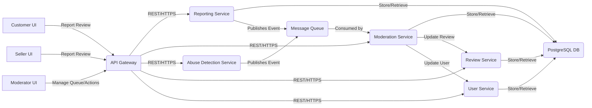

# Sprint 1 Implementation Plan: Amazon Review Abuse Tracking System (MVP)

## 1. Overall System Architecture

The system will adopt a microservices architecture to ensure scalability, maintainability, and clear separation of concerns.

*   **API Gateway:** Serves as the single entry point for all client requests (customer, seller, moderator UIs) and internal service-to-service communication.
*   **Review Service:** Manages all review-related data (creation, retrieval, updates, soft deletion). Assumed to be an existing core service, but our new system will interact with it for flagging and removal.
*   **Abuse Detection Service:** Houses the logic for automated pattern detection (keyword stuffing, similar phrasing, rapid succession).
*   **Reporting Service:** Handles receiving and processing review reports from customers and sellers.
*   **Moderation Service:** Manages the moderation queue, reviewer flagging, and orchestrates moderator actions.
*   **User Service:** (Assumed existing) Manages user accounts and their statuses (e.g., `isReviewerFlagged`). Our system will interact with it for flagging reviewers.
*   **Database:** PostgreSQL for relational data (Reviews, Reports, ModerationQueueItems, User statuses). Chosen for its robustness and ACID properties.
*   **Message Queue (e.g., AWS SQS):** For asynchronous communication between services, enabling decoupling and improved responsiveness (e.g., new review -> abuse detection; report received -> moderation queue).
*   **Frontend Applications:**
    *   **Customer-facing UI:** Integration for "Report Abuse" button.
    *   **Seller Portal UI:** Integration for "Report Fraudulent Review" button.
    *   **Moderator Dashboard UI:** A new web application for moderators to manage the queue and take actions.



## 2. Data Models (Core Entities)

*   **Review** (Assumed existing, but augmented for moderation)
    *   `reviewId` (PK, string)
    *   `productId` (string)
    *   `userId` (string)
    *   `rating` (integer)
    *   `title` (string)
    *   `comment` (text)
    *   `reviewDate` (datetime)
    *   `isDeleted` (boolean, default: `FALSE`) - For soft deletion
    *   `abuseFlagged` (boolean, default: `FALSE`) - Set by automated detection
    *   `moderationStatus` (ENUM: `PENDING`, `INVESTIGATING`, `APPROVED`, `REJECTED`, `REMOVED`, default: `PENDING`)
    *   `flaggedBy` (ENUM: `AUTOMATED`, `CUSTOMER`, `SELLER`, NULL)
    *   `flaggedReason` (text, NULL)
    *   `flaggedDate` (datetime, NULL)
    *   `moderatorActionTaken` (text, NULL)
    *   `moderatorId` (string, NULL)
    *   `actionDate` (datetime, NULL)

*   **User** (Assumed existing, augmented)
    *   `userId` (PK, string)
    *   `username` (string)
    *   `isReviewerFlagged` (boolean, default: `FALSE`) - Set by moderator
    *   `flaggingReason` (text, NULL)
    *   `flaggingDate` (datetime, NULL)
    *   `flaggedByModeratorId` (string, NULL)

*   **Report**
    *   `reportId` (PK, string)
    *   `reviewId` (FK, string)
    *   `reportingUserId` (FK, string) - Customer or Seller ID
    *   `reportType` (ENUM: `CUSTOMER_ABUSE`, `SELLER_FRAUD`)
    *   `reportReason` (text)
    *   `reportDate` (datetime)
    *   `status` (ENUM: `RECEIVED`, `PROCESSED`, `DISMISSED`, default: `RECEIVED`)

*   **ModerationQueueItem**
    *   `queueItemId` (PK, string)
    *   `reviewId` (FK, string)
    *   `flaggedSource` (ENUM: `AUTOMATED`, `CUSTOMER`, `SELLER`)
    *   `flaggedReason` (text)
    *   `flaggedDate` (datetime)
    *   `itemStatus` (ENUM: `NEW`, `IN_PROGRESS`, `RESOLVED`, default: `NEW`)
    *   `assignedModeratorId` (string, NULL)
    *   `relatedReportId` (FK, string, NULL) - Link to a specific report if applicable

## 3. Assumptions and Technical Decisions

**Assumptions:**

1.  **Existing Core Services:** Assumed existence of Amazon's core `Review Service` and `User Service` with basic APIs for data retrieval and (eventual) updates.
2.  **Authentication & Authorization:** Existing Amazon-wide authentication and authorization systems are in place for customers, sellers, and moderators.
3.  **Cloud Infrastructure:** Leveraging AWS (or similar) for managed services (API Gateway, SQS, RDS for PostgreSQL).
4.  **Scalability (MVP):** Initial focus is on functional MVP; high-scale optimization will be a future consideration.
5.  **Language/Framework:** Backend services will primarily use Python (Flask/FastAPI). Frontend applications will use modern JavaScript frameworks (e.g., React).

**Technical Decisions:**

1.  **Soft Deletion:** Reviews will be soft-deleted to preserve data integrity, auditing capabilities, and avoid potential data loss.
2.  **Asynchronous Processing:** Automated detection and report processing will heavily rely on message queues to ensure non-blocking operations and system resilience.
3.  **API First Design:** All inter-service communication and frontend interactions will be via well-defined RESTful APIs.
4.  **Rule-Based Detection for MVP:** Automated pattern detection will start with rule-based systems and statistical analysis (e.g., TF-IDF, cosine similarity) for faster implementation and immediate impact. Machine learning will be explored in later sprints.
5.  **Centralized Moderation Queue:** All flagged and reported reviews will converge into a single `ModerationQueueItem` table for a unified moderator workflow.

## 4. Implementation Plan by User Story & Task

### User Story 1: Automated Basic Pattern Detection

**Task 1.1: Research common suspicious review patterns**
*   **Implementation Plan:** Identify key patterns: keyword stuffing (repetitive terms), highly similar phrasing (near-duplicates), rapid succession (many reviews from same/new accounts in short time). Focus on quantifiable patterns for rule-based detection.
*   **Key Component:** `AbuseDetectionService`.
*   **Pseudocode:** N/A (Research)

**Task 1.2: Implement service for keyword stuffing detection**
*   **Implementation Plan:** Develop a function within `AbuseDetectionService`. It will calculate the density of product-specific keywords and common positive/negative terms. If a configurable threshold is exceeded, the review is flagged.
*   **Key Component:** `AbuseDetectionService`
*   **Code Snippet:**
    ```python
    def detect_keyword_stuffing(review_text: str, product_name: str, min_length=50, keyword_density_threshold=0.3) -> bool:
        keywords = set(product_name.lower().split() + ["great", "amazing", "best", "terrible", "worst", "product", "amazon"]) # Example keywords
        words = review_text.lower().split()
        if len(words) < min_length:
            return False
        keyword_count = sum(1 for word in words if word in keywords)
        density = keyword_count / len(words)
        return density > keyword_density_threshold

    # Integration:
    # if detect_keyword_stuffing(review.comment, review.product_name):
    #     flag_review_for_moderation(review.id, "KEYWORD_STUFFING", "AUTOMATED")
    ```

**Task 1.3: Implement service for highly similar phrasing detection**
*   **Implementation Plan:** Implement a function in `AbuseDetectionService`. For a new review, fetch recent reviews for the same product. Use TF-IDF vectorization and Cosine Similarity to compare the new review with existing ones. Flag if similarity exceeds a threshold.
*   **Key Component:** `AbuseDetectionService`
*   **Code Snippet:**
    ```python
    from sklearn.feature_extraction.text import TfidfVectorizer
    from sklearn.metrics.pairwise import cosine_similarity

    def detect_similar_phrasing(new_review_text: str, recent_reviews_texts: list[str], similarity_threshold=0.8) -> bool:
        if not recent_reviews_texts:
            return False
        all_texts = [new_review_text] + recent_reviews_texts
        vectorizer = TfidfVectorizer().fit_transform(all_texts)
        vectors = vectorizer.toarray()
        new_review_vector = vectors[0]
        other_reviews_vectors = vectors[1:]
        for other_vector in other_reviews_vectors:
            similarity = cosine_similarity([new_review_vector], [other_vector])[0][0]
            if similarity > similarity_threshold:
                return True
        return False

    # Integration:
    # recent_reviews = get_recent_reviews_for_product(review.product_id, last_N_days=7)
    # if detect_similar_phrasing(review.comment, [r.comment for r in recent_reviews]):
    #     flag_review_for_moderation(review.id, "SIMILAR_PHRASING", "AUTOMATED")
    ```

**Task 1.4: Implement service for rapid succession review detection**
*   **Implementation Plan:** In `AbuseDetectionService`, query for reviews by the same user within a short time window (e.g., 24 hours) or multiple new users reviewing the same product quickly. Flag if the count exceeds a threshold.
*   **Key Component:** `AbuseDetectionService`
*   **Code Snippet:**
    ```python
    from datetime import datetime, timedelta

    def detect_rapid_succession(user_id: str, review_date: datetime, product_id: str, time_window_hours=24, review_count_threshold=3) -> bool:
        # Placeholder for DB query:
        # past_reviews_by_user = db.get_reviews_by_user_in_time_frame(user_id, review_date - timedelta(hours=time_window_hours), review_date)
        # if len(past_reviews_by_user) >= review_count_threshold - 1:
        #    return True
        # More advanced logic for multiple new accounts on same product in short span could be added here.
        return False # Simplified for snippet

    # Integration:
    # if detect_rapid_succession(review.userId, review.reviewDate, review.productId):
    #     flag_review_for_moderation(review.id, "RAPID_SUCCESSION", "AUTOMATED")
    ```

**Task 1.5: Create basic flagging mechanism for suspicious reviews**
*   **Implementation Plan:** Implement an internal API endpoint or message queue event `flag_review_for_moderation` (in `Moderation Service`). This will update the `Review` record (`abuseFlagged=True`, `flaggedReason`, `flaggedBy='AUTOMATED'`) and create a new `ModerationQueueItem`.
*   **Key Component:** `Moderation Service`
*   **Code Snippet:**
    ```python
    from datetime import datetime
    # Pseudocode for Moderation Service function
    def flag_review_for_moderation(review_id: str, reason: str, source: str):
        # Update Review in DB (soft update)
        # db.update_review(review_id, abuseFlagged=True, flaggedReason=reason, flaggedBy=source, flaggedDate=datetime.now(), moderationStatus="PENDING")
        # Create ModerationQueueItem in DB
        # db.create_moderation_queue_item(reviewId=review_id, flaggedSource=source, flaggedReason=reason, flaggedDate=datetime.now(), itemStatus="NEW")
        # Publish internal event if other services need to react
        print(f"DEBUG: Review {review_id} flagged by {source} for reason: {reason}")
    ```

### User Story 2: Customer Review Reporting

**Task 2.1: Design UI/UX for "Report Abuse" button**
*   **Implementation Plan:** Design a small "Report Abuse" button/link near reviews. Clicking it opens a modal with predefined reasons (Spam, Offensive, Irrelevant, Other) and an optional text field for more details.
*   **Key Component:** Customer-facing UI.
*   **Pseudocode:** N/A (Design)

**Task 2.2: Implement "Report Abuse" button on customer-facing pages**
*   **Implementation Plan:** Add the UI button to relevant review display components. Implement JavaScript to show the modal, capture user input, and send an AJAX request to the backend API.
*   **Key Component:** Customer-facing UI.
*   **Code Snippet:**
    ```javascript
    // Simplified React/JS snippet
    async function submitCustomerReport(reviewId, reason, comment) {
        try {
            const response = await fetch('/api/v1/customer/report-review', {
                method: 'POST',
                headers: { 'Content-Type': 'application/json' },
                body: JSON.stringify({ reviewId, reason, comment })
            });
            if (!response.ok) throw new Error('Failed to report review');
            alert('Your report has been submitted.');
        } catch (error) {
            console.error(error);
            alert('There was an error submitting your report.');
        }
    }
    ```

**Task 2.3: Develop backend API endpoint for receiving customer reports**
*   **Implementation Plan:** Create a `POST /api/v1/customer/report-review` endpoint in the `Reporting Service`. It will validate input, store the report in the `Report` table, and publish a `customer_review_reported` message to the message queue.
*   **Key Component:** `Reporting Service`.
*   **Code Snippet:**
    ```python
    from flask import Flask, request, jsonify
    from datetime import datetime
    app = Flask(__name__) # Assuming a Flask app instance

    @app.route('/api/v1/customer/report-review', methods=['POST'])
    def handle_customer_report():
        data = request.json
        # review_id = data['reviewId']; reason = data['reason']; comment = data.get('comment', '')
        # reporting_user_id = get_user_id_from_auth_token(request.headers.get('Authorization'))
        # db.create_report(reviewId=review_id, reportingUserId=reporting_user_id, reportType="CUSTOMER_ABUSE", reportReason=f"{reason}: {comment}", reportDate=datetime.now(), status="RECEIVED")
        # publish_message_to_queue("customer_review_reported", {"reportId": "new_report_id", "reviewId": review_id, "source": "CUSTOMER", "reason": f"{reason}: {comment}"})
        print(f"DEBUG: Received customer report for review {data.get('reviewId')}")
        return jsonify({"message": "Report received"}), 201
    ```

**Task 2.4: Store reported review data in moderation queue**
*   **Implementation Plan:** The `Moderation Service` will consume `customer_review_reported` messages from the queue. For each message, it will create a new `ModerationQueueItem` linked to the `Review` and `Report`.
*   **Key Component:** `Moderation Service`.
*   **Code Snippet:**
    ```python
    # Pseudocode for Moderation Service queue consumer
    def process_customer_report_message(message_body: dict):
        # review_id = message_body['reviewId']; reason = message_body['reason']; report_id = message_body['reportId']
        # db.create_moderation_queue_item(reviewId=review_id, flaggedSource="CUSTOMER", flaggedReason=reason, flaggedDate=datetime.now(), itemStatus="NEW", relatedReportId=report_id)
        # db.update_report_status(report_id, "PROCESSED")
        print(f"DEBUG: Customer report for review {message_body.get('reviewId')} added to moderation queue.")
    ```

### User Story 3: Seller Review Reporting

**Task 3.1: Design UI/UX for "Report Fraudulent Review" button on seller portal**
*   **Implementation Plan:** Design a button/link in the seller portal's review management section. The modal for reporting will offer reasons specific to seller concerns (e.g., "Competitor Attack", "False Information").
*   **Key Component:** Seller Portal UI.
*   **Pseudocode:** N/A (Design)

**Task 3.2: Implement "Report Fraudulent Review" button on seller portal**
*   **Implementation Plan:** Add the UI button to the seller portal review components. Implement JavaScript to show the modal, capture input, and send an AJAX request to the backend API.
*   **Key Component:** Seller Portal UI.
*   **Code Snippet:**
    ```javascript
    // Simplified React/JS snippet for seller portal
    async function submitSellerReport(reviewId, reason, comment) {
        try {
            const response = await fetch('/api/v1/seller/report-review', {
                method: 'POST',
                headers: { 'Content-Type': 'application/json' },
                body: JSON.stringify({ reviewId, reason, comment })
            });
            if (!response.ok) throw new Error('Failed to report review');
            alert('Your report has been submitted to moderation.');
        } catch (error) {
            console.error(error);
            alert('There was an error submitting your report.');
        }
    }
    ```

**Task 3.3: Develop backend API endpoint for receiving seller reports**
*   **Implementation Plan:** Create a `POST /api/v1/seller/report-review` endpoint in the `Reporting Service`. It will validate input, store the report, and publish a `seller_review_reported` message to the message queue.
*   **Key Component:** `Reporting Service`.
*   **Code Snippet:**
    ```python
    from flask import request, jsonify
    from datetime import datetime
    # Assuming app = Flask(__name__) is defined elsewhere

    @app.route('/api/v1/seller/report-review', methods=['POST'])
    def handle_seller_report():
        data = request.json
        # review_id = data['reviewId']; reason = data['reason']; comment = data.get('comment', '')
        # reporting_seller_id = get_seller_id_from_auth_token(request.headers.get('Authorization'))
        # db.create_report(reviewId=review_id, reportingUserId=reporting_seller_id, reportType="SELLER_FRAUD", reportReason=f"{reason}: {comment}", reportDate=datetime.now(), status="RECEIVED")
        # publish_message_to_queue("seller_review_reported", {"reportId": "new_report_id", "reviewId": review_id, "source": "SELLER", "reason": f"{reason}: {comment}"})
        print(f"DEBUG: Received seller report for review {data.get('reviewId')}")
        return jsonify({"message": "Report received"}), 201
    ```

**Task 3.4: Store reported review data from sellers in the moderation queue**
*   **Implementation Plan:** The `Moderation Service` will consume `seller_review_reported` messages. For each message, it will create a new `ModerationQueueItem` linked to the `Review` and `Report`.
*   **Key Component:** `Moderation Service`.
*   **Code Snippet:**
    ```python
    # Pseudocode for Moderation Service queue consumer
    def process_seller_report_message(message_body: dict):
        # review_id = message_body['reviewId']; reason = message_body['reason']; report_id = message_body['reportId']
        # db.create_moderation_queue_item(reviewId=review_id, flaggedSource="SELLER", flaggedReason=reason, flaggedDate=datetime.now(), itemStatus="NEW", relatedReportId=report_id)
        # db.update_report_status(report_id, "PROCESSED")
        print(f"DEBUG: Seller report for review {message_body.get('reviewId')} added to moderation queue.")
    ```

### User Story 4: Moderator Review Queue & Basic Tools

**Task 4.1: Design basic moderator dashboard layout**
*   **Implementation Plan:** Design a simple web dashboard. A main content area for the queue (table with key info), sidebar for navigation/filters, and a detail panel/modal for individual reviews.
*   **Key Component:** Moderator Dashboard UI.
*   **Pseudocode:** N/A (Design)

**Task 4.2: Develop web interface for moderator queue**
*   **Implementation Plan:** Build the frontend (React/Angular/Vue). Implement a page to fetch `ModerationQueueItem`s from `Moderation Service` API (`GET /api/v1/moderator/queue`) and display them in a table.
*   **Key Component:** Moderator Dashboard UI, `Moderation Service`.
*   **Code Snippet:**
    ```python
    # In ModerationService/app.py (API endpoint)
    @app.route('/api/v1/moderator/queue', methods=['GET'])
    def get_moderation_queue():
        # if not is_moderator_authenticated(...): return jsonify(...), 401
        # queue_items = db.get_moderation_queue_items(status="NEW,IN_PROGRESS")
        # return jsonify([item.to_dict() for item in queue_items]), 200
        print("DEBUG: Fetching moderator queue.")
        return jsonify([{"queueItemId": "q1", "reviewId": "r101", "flaggedSource": "AUTOMATED", "flaggedReason": "KEYWORD_STUFFING", "itemStatus": "NEW"}]), 200
    ```
    ```javascript
    // In Moderator Dashboard UI (React component)
    import React, { useState, useEffect } from 'react';
    function ModeratorQueue() {
        const [items, setItems] = useState([]);
        useEffect(() => {
            const fetchQueue = async () => {
                const res = await fetch('/api/v1/moderator/queue', { headers: { 'Authorization': 'Bearer moderator_token' } });
                const data = await res.json();
                setItems(data);
            };
            fetchQueue();
        }, []);
        return (
            <table>
                <thead><tr><th>Review ID</th><th>Source</th><th>Reason</th><th>Status</th></tr></thead>
                <tbody>
                    {items.map(item => (<tr key={item.queueItemId}>
                        <td>{item.reviewId}</td><td>{item.flaggedSource}</td><td>{item.flaggedReason}</td><td>{item.itemStatus}</td>
                    </tr>))}
                </tbody>
            </table>
        );
    }
    ```

**Task 4.3: Implement view review details in moderator interface**
*   **Implementation Plan:** When a queue item is selected, call `GET /api/v1/reviews/{reviewId}` (from `Review Service`) to display the full review content, product ID, rating, etc., in a dedicated detail panel.
*   **Key Component:** Moderator Dashboard UI, `Review Service`.
*   **Code Snippet:**
    ```python
    # In ReviewService/app.py (API endpoint)
    @app.route('/api/v1/reviews/<review_id>', methods=['GET'])
    def get_review_details(review_id):
        # if not is_moderator_authenticated(...): return jsonify(...), 401
        # review = db.get_review_by_id(review_id)
        # return jsonify(review.to_dict()), 200
        print(f"DEBUG: Fetching details for review {review_id}.")
        return jsonify({"reviewId": review_id, "productId": "p123", "userId": "u456", "comment": "This is a dummy review comment.", "rating": 1}), 200
    ```
    ```javascript
    // In Moderator Dashboard UI (part of detail view)
    async function fetchReviewDetails(reviewId) {
        const res = await fetch(`/api/v1/reviews/${reviewId}`, { headers: { 'Authorization': 'Bearer moderator_token' } });
        const data = await res.json();
        // Display data in UI
        return data;
    }
    ```

**Task 4.4: Implement view basic reviewer history in moderator interface**
*   **Implementation Plan:** In the review detail view, fetch `GET /api/v1/users/{userId}/reviews` (from `Review Service`) and `GET /api/v1/users/{userId}` (from `User Service`) to display other reviews by the same user and their `isReviewerFlagged` status.
*   **Key Component:** Moderator Dashboard UI, `Review Service`, `User Service`.
*   **Code Snippet:**
    ```python
    # In ReviewService/app.py (API endpoint for user reviews)
    @app.route('/api/v1/users/<user_id>/reviews', methods=['GET'])
    def get_user_reviews(user_id):
        # if not is_moderator_authenticated(...): return jsonify(...), 401
        # reviews = db.get_reviews_by_user_id(user_id, limit=5)
        # return jsonify([r.to_dict() for r in reviews]), 200
        print(f"DEBUG: Fetching reviews for user {user_id}.")
        return jsonify([{"reviewId": "r_old1", "title": "Great product!", "rating": 5}]), 200

    # In UserService/app.py (API endpoint for user status - or ReviewService if consolidated)
    @app.route('/api/v1/users/<user_id>', methods=['GET'])
    def get_user_status(user_id):
        # if not is_moderator_authenticated(...): return jsonify(...), 401
        # user = db.get_user_by_id(user_id)
        # return jsonify({"userId": user.userId, "isReviewerFlagged": user.isReviewerFlagged}), 200
        print(f"DEBUG: Fetching user status for {user_id}.")
        return jsonify({"userId": user_id, "isReviewerFlagged": False}), 200
    ```
    ```javascript
    // In Moderator Dashboard UI (part of detail view)
    async function fetchReviewerHistory(userId) {
        const [reviewsRes, userStatusRes] = await Promise.all([
            fetch(`/api/v1/users/${userId}/reviews`, { headers: { 'Authorization': 'Bearer moderator_token' } }),
            fetch(`/api/v1/users/${userId}`, { headers: { 'Authorization': 'Bearer moderator_token' } })
        ]);
        const reviews = await reviewsRes.json();
        const userStatus = await userStatusRes.json();
        // Display history and flagged status
        return { reviews, isFlagged: userStatus.isReviewerFlagged };
    }
    ```

### User Story 5: Review Removal & Reviewer Flagging

**Task 5.1: Design UI for moderator actions (remove, flag)**
*   **Implementation Plan:** Add "Remove Review" and "Flag Reviewer" buttons to the review detail panel. Include confirmation dialogs for both actions.
*   **Key Component:** Moderator Dashboard UI.
*   **Pseudocode:** N/A (Design)

**Task 5.2: Implement "Remove Review" button/action in moderator interface**
*   **Implementation Plan:** Implement click handler for the "Remove Review" button. Show a confirmation dialog. On confirmation, make an AJAX call to the `Moderation Service` API endpoint (`POST /api/v1/moderator/reviews/{reviewId}/remove`).
*   **Key Component:** Moderator Dashboard UI.
*   **Code Snippet:**
    ```javascript
    // In Moderator Dashboard UI (part of detail view)
    async function removeReview(reviewId) {
        if (!window.confirm('Confirm removal of this review?')) return;
        const res = await fetch(`/api/v1/moderator/reviews/${reviewId}/remove`, {
            method: 'POST',
            headers: { 'Content-Type': 'application/json', 'Authorization': 'Bearer moderator_token' }
        });
        if (res.ok) alert('Review removed successfully.');
        else alert('Error removing review.');
        // Refresh queue or update UI
    }
    ```

**Task 5.3: Develop backend API to soft-delete/hide a review**
*   **Implementation Plan:** Create a `POST /api/v1/moderator/reviews/{reviewId}/remove` endpoint in the `Moderation Service`. This API will update the `isDeleted` flag and `moderationStatus` of the `Review` record (via `Review Service` or direct DB access), and set the `ModerationQueueItem` status to `RESOLVED`.
*   **Key Component:** `Moderation Service`.
*   **Code Snippet:**
    ```python
    # In ModerationService/app.py (API endpoint)
    @app.route('/api/v1/moderator/reviews/<review_id>/remove', methods=['POST'])
    def handle_remove_review(review_id):
        # if not is_moderator_authenticated(...): return jsonify(...), 401
        # moderator_id = get_moderator_id_from_auth_token(...)
        # db.update_review(review_id, isDeleted=True, moderationStatus="REMOVED", moderatorId=moderator_id, actionDate=datetime.now())
        # db.update_moderation_queue_item_status(review_id, "RESOLVED")
        # publish_message_to_queue("review_removed_event", {"reviewId": review_id})
        print(f"DEBUG: Review {review_id} soft-deleted by moderator.")
        return jsonify({"message": "Review soft-deleted"}), 200
    ```

**Task 5.4: Implement "Flag Reviewer Account" button/action in moderator interface**
*   **Implementation Plan:** Implement click handler for "Flag Reviewer Account". Show confirmation. On confirmation, make an AJAX call to `POST /api/v1/moderator/users/{userId}/flag`.
*   **Key Component:** Moderator Dashboard UI.
*   **Code Snippet:**
    ```javascript
    // In Moderator Dashboard UI (part of detail view)
    async function flagReviewer(userId) {
        if (!window.confirm('Confirm flagging this reviewer account?')) return;
        const res = await fetch(`/api/v1/moderator/users/${userId}/flag`, {
            method: 'POST',
            headers: { 'Content-Type': 'application/json', 'Authorization': 'Bearer moderator_token' }
        });
        if (res.ok) alert('Reviewer flagged successfully.');
        else alert('Error flagging reviewer.');
        // Update UI to show flagged status
    }
    ```

**Task 5.5: Develop backend API to mark reviewer account for investigation**
*   **Implementation Plan:** Create a `POST /api/v1/moderator/users/{userId}/flag` endpoint in the `Moderation Service`. This API will update the `isReviewerFlagged` status of the `User` record (via `User Service` or direct DB access), along with flagging details.
*   **Key Component:** `Moderation Service`.
*   **Code Snippet:**
    ```python
    # In ModerationService/app.py (API endpoint)
    @app.route('/api/v1/moderator/users/<user_id>/flag', methods=['POST'])
    def handle_flag_reviewer(user_id):
        # if not is_moderator_authenticated(...): return jsonify(...), 401
        # moderator_id = get_moderator_id_from_auth_token(...)
        # flag_reason = request.json.get('reason', 'Manual flag by moderator')
        # db.update_user(user_id, isReviewerFlagged=True, flaggingReason=flag_reason, flaggedByModeratorId=moderator_id, flaggingDate=datetime.now())
        # publish_message_to_queue("reviewer_flagged_event", {"userId": user_id})
        print(f"DEBUG: User {user_id} flagged for investigation by moderator.")
        return jsonify({"message": "Reviewer account flagged"}), 200
    ```
