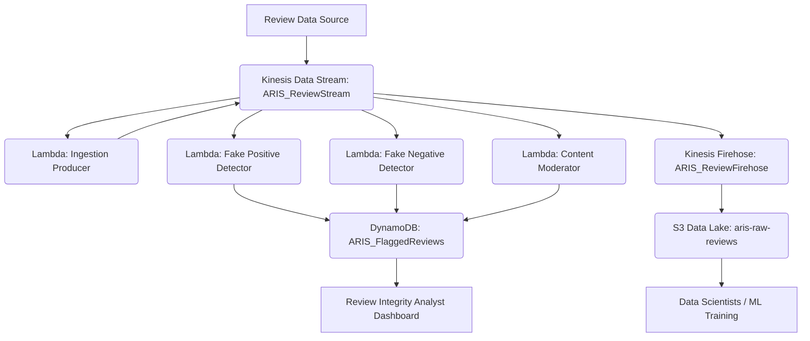

# Overall Architecture for Amazon Review Integrity Shield (ARIS)

**Architecture Overview:**
The Amazon Review Integrity Shield (ARIS) system will leverage a real-time, event-driven architecture hosted on AWS.

*   **Data Source:** Incoming Amazon review data (assumed to be pushed as events).
*   **Ingestion Layer (AWS Kinesis Data Streams):** A central Kinesis stream will receive all raw review data, acting as a highly scalable and durable buffer.
*   **Processing Layer (AWS Lambda / Kinesis Analytics):** Serverless AWS Lambda functions will consume from the Kinesis stream. Each detection module (Fake Positive, Fake Negative, Content Moderation) will run as an independent Lambda function, processing reviews in real-time. For more complex stateful operations (like true windowing for amplification detection), AWS Kinesis Data Analytics (Apache Flink) could be introduced in future sprints.
*   **Storage Layer:**
    *   **Raw Reviews (AWS S3 Data Lake):** A Kinesis Firehose delivery stream will automatically backup all raw review data to S3 for historical analysis, machine learning training, and auditing.
    *   **Flagged Reviews (AWS DynamoDB):** A NoSQL DynamoDB table will store all detected abuse flags, providing low-latency access for Review Integrity Analysts.

**Assumptions and Technical Decisions:**

*   **Cloud Platform:** AWS is the chosen cloud provider.
*   **Programming Language:** Python for all Lambda functions and detection logic.
*   **Scalability:** The architecture prioritizes horizontal scalability using managed services like Kinesis, Lambda, S3, and DynamoDB.
*   **Real-time Definition:** "Real-time" implies processing latency of a few seconds to a minute for detection and flagging.
*   **Data Volume:** The system is designed to handle high volumes of review data (millions daily).
*   **Security:** PII handling (e.g., IP addresses) will be addressed with anonymization/masking in future sprints. IAM roles will enforce least privilege access.
*   **Observability:** CloudWatch for logging, monitoring, and alerting will be configured in subsequent sprints.
*   **Detection Strategy:** Initial detection will be rule-based for quick implementation and immediate value. Machine learning models will be integrated in later sprints as data and confidence grow.
*   **State Management:** For simple, independent checks, Lambda is sufficient. For sophisticated windowing (e.g., counting N reviews in T time for amplification), external state (DynamoDB or Kinesis Analytics) will be used. This sprint focuses on flagging individual suspicious reviews based on immediate characteristics.
