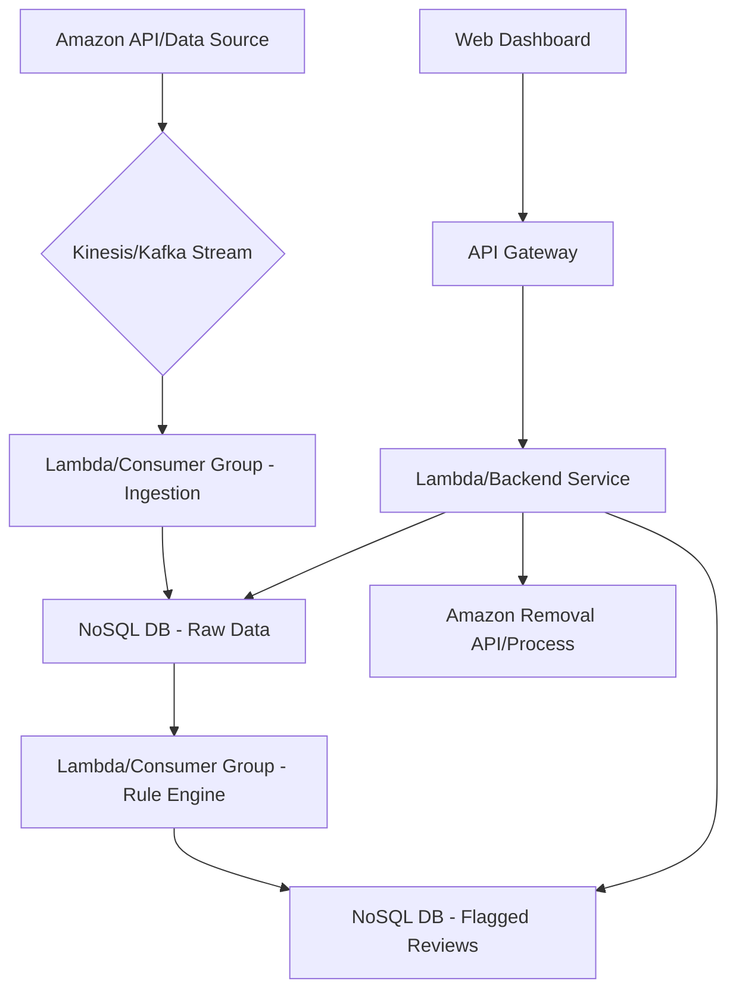

# Sprint Backlog Implementation Plan: Amazon Review Integrity System

**Sprint Goal:** Establish the foundational data ingestion and basic rule-based detection capabilities for the Amazon Review Integrity System, enabling Trust & Safety Analysts to view and manually remove obvious review abuse.

---

### **Overall Architecture & Data Models**

**High-Level Architecture:**

The system will follow a serverless, event-driven architecture to ensure scalability, cost-effectiveness, and real-time processing capabilities.

1.  **Data Ingestion Layer:** Real-time stream processing (e.g., AWS Kinesis/Kafka) to capture reviews, reviewer profiles, and product information.
2.  **Processing Layer:** Serverless functions (e.g., AWS Lambda) triggered by the ingestion stream to process and store raw data, and subsequently apply rule-based checks.
3.  **Storage Layer:** NoSQL database (e.g., DynamoDB, MongoDB Atlas) for flexible schema and high throughput, storing raw ingested data, flagged reviews, and rule configurations.
4.  **Rule Engine:** A dedicated module within the processing layer that evaluates incoming data against predefined rules.
5.  **API Layer:** RESTful API (e.g., AWS API Gateway + Lambda/Flask) to serve flagged reviews to the dashboard and handle remediation actions.
6.  **Presentation Layer:** A web-based dashboard (e.g., React/Vue) for Trust & Safety Analysts.

**Data Models:**

(See `data_models.py` for Python class definitions)

*   `Review`: Represents an Amazon product review.
*   `ReviewerProfile`: Stores information about an Amazon reviewer.
*   `Product`: Contains details about an Amazon product.
*   `FlaggedReview`: Stores details of reviews identified as suspicious by the rule engine.

---

### **P0: Critical / MVP - Core Detection & Remediation**

#### **1. As a System Administrator, I need to ingest all new Amazon product reviews, reviewer profiles, and product information in real-time, so that the system has the necessary data for analysis.**

**Implementation Plan:**

*   **Task 1.1: Research Amazon API/data sources for real-time review data (4 hours)**
    *   Investigate Amazon Selling Partner API (SP-API) for product and review data.
    *   Explore potential challenges: rate limits, data availability for reviews (often restricted to seller-specific data, not public scrape).
    *   Alternative: Consider a third-party data provider or web scraping (if Amazon API is not suitable for public review ingestion, which is likely for real-time *all* reviews). For MVP, we'll assume a mechanism exists to push data to our system.
*   **Task 1.2: Design data ingestion architecture (e.g., Kafka, Kinesis) (8 hours)**
    *   Decision: Use AWS Kinesis Data Streams for real-time ingestion due to its managed nature and integration with other AWS services (Lambda, DynamoDB). Kafka is a strong alternative for larger scale on-prem/hybrid.
    *   Design Kinesis stream with appropriate shards for expected throughput.
    *   Outline the flow: Data Source -> Kinesis Stream -> Kinesis Firehose (for S3 backup/archiving) / Kinesis Data Analytics (optional for pre-processing) / Lambda Consumers.
*   **Task 1.3: Implement basic data ingestion pipeline for reviews (16 hours)**
    *   Develop a Lambda function (or equivalent consumer application) to read from the Kinesis stream.
    *   Parse incoming review data (JSON).
    *   Store the parsed `Review` objects into the NoSQL database (e.g., DynamoDB table named `reviews`).
    *   Implement error handling and retry mechanisms for database writes.
*   **Task 1.4: Implement data ingestion for reviewer profiles and product info (12 hours)**
    *   Extend the ingestion pipeline or create separate Lambda functions/streams for `ReviewerProfile` and `Product` data.
    *   Store `ReviewerProfile` objects into `reviewer_profiles` table.
    *   Store `Product` objects into `products` table.
    *   Ensure data consistency (e.g., eventually consistent relationships via IDs).
*   **Task 1.5: Set up data storage (e.g., NoSQL database) for ingested data (8 hours)**
    *   Provision AWS DynamoDB tables: `reviews`, `reviewer_profiles`, `products`.
    *   Define primary keys: `review_id` for `reviews`, `reviewer_id` for `reviewer_profiles`, `product_id` for `products`.
    *   Configure read/write capacity units (on-demand or provisioned based on expected load).
*   **Task 1.6: Develop monitoring for data ingestion pipeline (6 hours)**
    *   Set up CloudWatch Alarms for Kinesis stream (e.g., `ReadProvisionedThroughputExceeded`, `WriteProvisionedThroughputExceeded`, `IncomingBytes`, `IncomingRecords`).
    *   Monitor Lambda function metrics (e.g., `Invocations`, `Errors`, `Duration`, `Throttles`).
    *   Configure logging for Lambda functions to CloudWatch Logs.
    *   Create a dashboard in CloudWatch to visualize key metrics.

**Assumptions and Technical Decisions:**

*   **Assumption:** There is a reliable mechanism (e.g., an internal service, a specific Amazon API, or a third-party feed) that can push real-time review, reviewer, and product data into our Kinesis stream. Direct public real-time access to "all" Amazon reviews is generally not available via a simple API.
*   **Decision:** AWS Kinesis for streaming, DynamoDB for NoSQL storage due to managed service benefits, scalability, and integration with AWS ecosystem.
*   **Decision:** Serverless Lambda functions for consumers to automatically scale with ingestion volume.
*   **Assumption:** Data pushed to Kinesis will be in a consistent JSON format that maps directly to our data models.

**Code Snippet (Pseudocode for Kinesis Lambda Consumer):**
(See `ingestion_pipeline_pseudocode.py`)

---

#### **2. As a Trust & Safety Analyst, I need the system to apply a set of foundational rule-based checks (e.g., rapid review submission by new accounts, identical review content across multiple products, unusually high volume of reviews for a single product from new accounts) to flag suspicious reviews, so that obvious abuse patterns can be identified immediately.**

**Implementation Plan:**

*   **Task 2.1: Define initial set of rule-based checks (6 hours)**
    *   **Rule 1: Rapid Review Submission by New Accounts:** Flag reviews from accounts created within (e.g., 30 days) that submit more than (e.g., 5 reviews) within a short period (e.g., 24 hours). Requires `ReviewerProfile` and `Review` data.
    *   **Rule 2: Identical Review Content:** Flag reviews with high similarity (e.g., >90% textual similarity) across different products or by different reviewers. Requires `Review` data, potentially a mechanism for content hashing/embeddings.
    *   **Rule 3: Unusually High Volume of Reviews for a Single Product from New Accounts:** Flag products receiving an unusually high number of reviews from new accounts within a short period. Requires `Product`, `Review`, and `ReviewerProfile` data, and aggregation capabilities.
    *   **Rule 4: Keyword/Phrase Matching:** Flag reviews containing specific abusive or promotional keywords/phrases. Requires `Review` data.
*   **Task 2.2: Design rule engine architecture (10 hours)**
    *   Extend the processing layer with another Lambda function (or stream consumer) triggered by the `reviews` Kinesis stream (or a separate stream for processed reviews from ingestion).
    *   The rule engine will consume `Review` objects.
    *   It will query `ReviewerProfile` and `Product` tables for contextual data.
    *   It will apply predefined rules and store `FlaggedReview` objects in a dedicated DynamoDB table (`flagged_reviews`).
    *   Rules will be configurable, potentially stored in a separate configuration store (e.g., S3, DynamoDB config table).
*   **Task 2.3: Implement rule engine to process incoming reviews (18 hours)**
    *   Develop the core logic for each defined rule.
    *   Implement functions to fetch related `ReviewerProfile` and `Product` data.
    *   Create a rule evaluation pipeline that takes a `Review` and returns a list of triggered rule names.
    *   Utilize a similarity library (e.g., `difflib`, `fuzzywuzzy`, or simple hashing for exact matches) for content similarity checks.
*   **Task 2.4: Integrate rule engine with ingested data pipeline (10 hours)**
    *   The rule engine Lambda will be configured to consume from a `reviews_for_analysis` Kinesis stream.
    *   After a review is successfully ingested into the `reviews` table by the ingestion Lambda, it will push a message to this `reviews_for_analysis` Kinesis stream. This decouples ingestion and rule evaluation.
*   **Task 2.5: Develop basic logging for flagged reviews (4 hours)**
    *   Ensure that every `FlaggedReview` object stored includes the `flagging_reasons`.
    *   Log detailed information about why a review was flagged (e.g., which rule, what thresholds were met) to CloudWatch Logs.
*   **Task 2.6: Create initial rules in the system (6 hours)**
    *   Define the initial rules as data structures (e.g., JSON objects) that can be loaded by the rule engine.
    *   Store these rules in a DynamoDB configuration table or S3 bucket.

**Assumptions and Technical Decisions:**

*   **Decision:** A separate Kinesis stream (`reviews_for_analysis`) will be used to decouple the ingestion and rule evaluation, allowing for independent scaling and error handling.
*   **Decision:** Rules will be data-driven and configurable, allowing Trust & Safety to modify thresholds without code deployments.
*   **Decision:** DynamoDB for `flagged_reviews` table.
*   **Assumption:** Contextual data (reviewer profiles, product info) will be readily available in DynamoDB for lookup by the rule engine with low latency.

**Code Snippet (Pseudocode for Rule Engine Lambda Consumer):**
(See `rule_engine_pseudocode.py`)

**Initial Rule Configurations (Pseudocode):**
(See `rule_configurations.py`)

---

#### **3. As a Trust & Safety Analyst, I need a dashboard to view all flagged suspicious reviews, including the reason for flagging, so that I can quickly triage and investigate potential abuse.**

**Implementation Plan:**

*   **Task 3.1: Design dashboard UI/UX wireframes (8 hours)**
    *   Basic layout: Sidebar for navigation, main content area for review list.
    *   Review list: Table with columns for `review_id`, `product_id`, `reviewer_id`, `flagged_date`, `flagging_reasons`, `status`.
    *   Detail view: Clickable rows to open a modal/new page with full review content and all flagged details.
    *   Filtering/Sorting options (by status, date, rule).
*   **Task 3.2: Set up front-end framework (12 hours)**
    *   Choose a lightweight framework: React (with Create React App), Vue.js (with Vue CLI), or a simple HTML/CSS/JS setup for MVP. Let's assume React.
    *   Set up basic project structure, routing, and component definitions.
    *   Integrate a UI library (e.g., Material-UI, Ant Design) for quick component development.
*   **Task 3.3: Develop API endpoint for fetching flagged reviews (14 hours)**
    *   Create a RESTful API using AWS API Gateway and Lambda (or Flask/Node.js backend on EC2/Fargate).
    *   Endpoint: `/flagged-reviews` (GET).
    *   This API will query the `flagged_reviews` DynamoDB table.
    *   Support query parameters for filtering (e.g., `status=PENDING_TRIAGE`, `startDate`, `endDate`, `rule`).
    *   Support pagination and sorting.
    *   The API should also fetch relevant details from `reviews`, `reviewer_profiles`, and `products` tables to enrich the flagged review data.
*   **Task 3.4: Implement UI for displaying flagged reviews with reasons (18 hours)**
    *   Develop the main component for the flagged reviews list.
    *   Fetch data from the `/flagged-reviews` API endpoint.
    *   Render data in a tabular format.
    *   Display `flagging_reasons` clearly, perhaps as badges or tags.
    *   Implement click handler for each review to show more details.
*   **Task 3.5: Implement basic filtering and sorting on the dashboard (8 hours)**
    *   Add dropdowns/input fields for filtering by `status` and `flagging_reasons`.
    *   Add date range pickers for `flagged_date`.
    *   Implement client-side or server-side sorting based on column headers (e.g., `flagged_date`).

**Assumptions and Technical Decisions:**

*   **Decision:** AWS API Gateway + Lambda for the backend API due to scalability and managed service benefits.
*   **Decision:** React for the frontend, as it's widely used and efficient for building SPAs.
*   **Assumption:** The API will handle joining/enriching data from multiple DynamoDB tables efficiently (e.g., by performing parallel lookups or using a GraphQL layer for complex queries). For MVP, direct DynamoDB queries are fine.

**Code Snippet (Pseudocode for Dashboard API Endpoint):**
(See `dashboard_api_pseudocode.py`)

---

#### **4. As a Trust & Safety Analyst, I need to be able to manually mark a review as abusive and trigger its removal, so that I can take immediate action on confirmed fraudulent reviews.**

**Implementation Plan:**

*   **Task 4.1: Design database schema for review status (6 hours)**
    *   The `FlaggedReview` data model already includes a `status` field. We will leverage this.
    *   Possible statuses: `PENDING_TRIAGE`, `UNDER_INVESTIGATION`, `ABUSIVE`, `FALSE_POSITIVE`, `REMOVED`.
    *   Add `triage_notes` and `triage_analyst_id` fields to `FlaggedReview` to track actions.
*   **Task 4.2: Develop API endpoint to update review status to 'abusive' (10 hours)**
    *   Create a PUT/POST endpoint: `/flagged-reviews/{flagged_review_id}/status`
    *   This API will take `flagged_review_id`, new `status` (e.g., "ABUSIVE"), `triage_notes`, and `triage_analyst_id` as input.
    *   It will update the corresponding item in the `flagged_reviews` DynamoDB table.
    *   It will also trigger the review removal process if the status is "ABUSIVE" or "REMOVED".
*   **Task 4.3: Implement "Mark as Abusive" button on dashboard UI (8 hours)**
    *   Add a button (e.g., "Mark as Abusive" / "Remove Review") within the detail view of a flagged review.
    *   This button will call the new API endpoint.
    *   Update the review's status on the UI upon successful API call.
*   **Task 4.4: Integrate with Amazon's review removal API/process (16 hours)**
    *   This is a critical integration point. **Assumption:** There is an existing Amazon API or a well-defined process to request review removal (e.g., a specific endpoint for Amazon Seller/Vendor Central, or an internal Amazon tool).
    *   The backend API endpoint for updating status will, upon marking as "ABUSIVE", invoke a separate function or service that interacts with the Amazon removal API.
    *   This integration will handle authentication, request formatting, and error handling for the Amazon API. For MVP, this might be a placeholder mock or a notification system to a manual team.
    *   Update the `FlaggedReview` status to `REMOVED` after successful interaction with Amazon's API.
*   **Task 4.5: Add confirmation dialog for marking reviews (4 hours)**
    *   Before sending the request to mark a review as abusive, display a confirmation dialog to the analyst to prevent accidental actions.
    *   Allow the analyst to add optional notes in the dialog.

**Assumptions and Technical Decisions:**

*   **Assumption:** There is an accessible Amazon API or a clear process for programmatic review removal. This is a significant assumption as such an API might not be publicly available or easy to integrate with. For MVP, we'll mock this integration.
*   **Decision:** The status update API will trigger the Amazon removal process asynchronously (e.g., by publishing an event to an SQS queue or a dedicated Lambda) to avoid blocking the user and to handle retries.
*   **Decision:** Use the existing `FlaggedReview` data model; no new tables are required for status tracking.

**Code Snippet (Pseudocode for Remediation API Endpoint):**
(See `remediation_api_pseudocode.py`)
